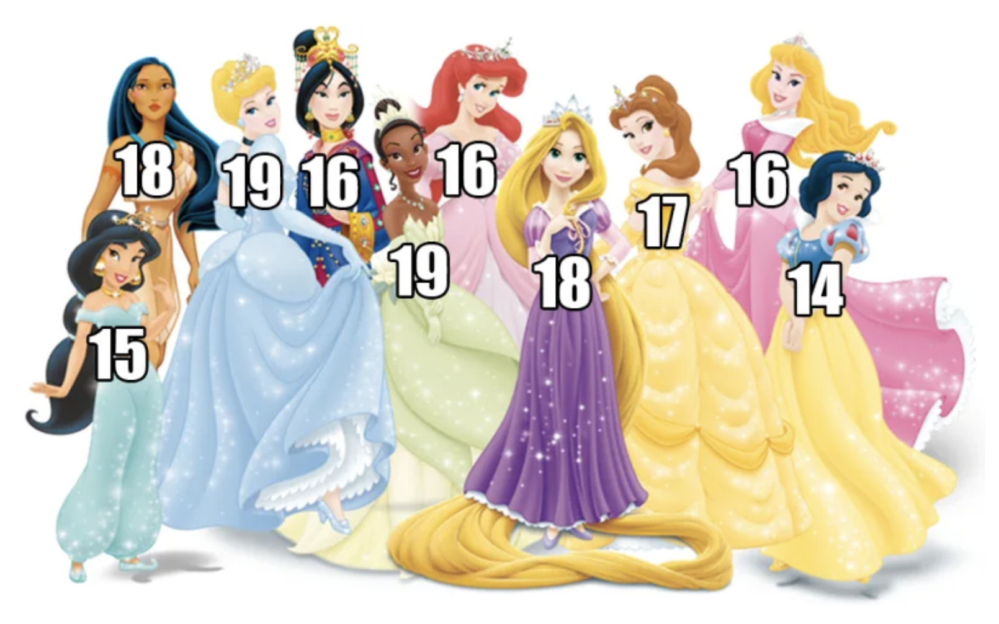
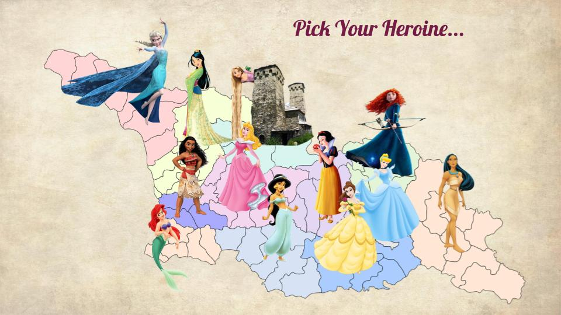
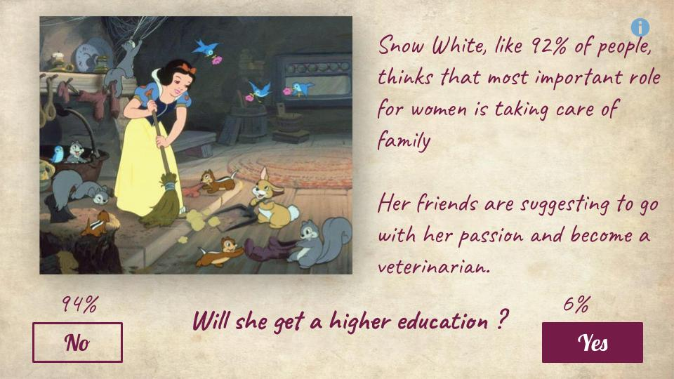

  

Fairy tales end at “they lived happily ever after”. 

  
  
But what would have happened in the lives of well-known Disney Princesses if they were average Georgian Girls aged 14-20 living in different regions of Georgia? 

  
  
To portray the gender inequality, the tools use generalized data for the same age group to assume different scenarios concerning early marriage, education, business activity etc.

